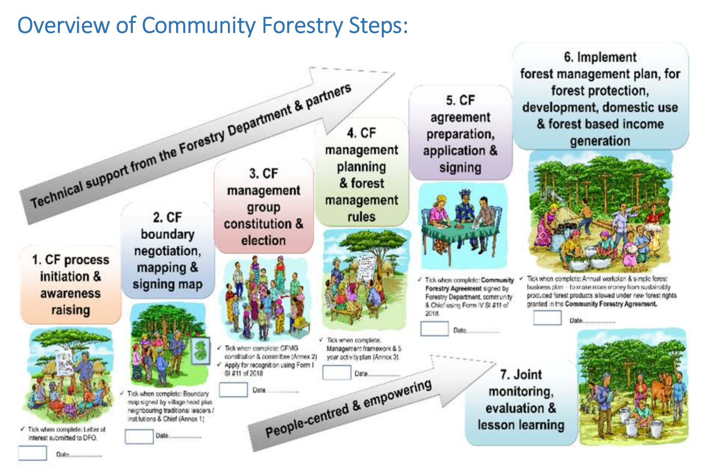

### Community forestry

Community forest management (CFM) has emerged over the past five decades as a dominant paradigm in forest governance, grounded in the recognition that local communities — as the *de facto* managers over large areas of the world's forests — are best placed to sustainably manage the resources on which they depend. At its core, CFM involves the formal transfer of management authority and resource use rights, including the right to benefit from the sale of forest resources, from state institutions to local communities [@charnley2007; @fao1978]. Early programmes in the 1970s and 1980s focused narrowly on fuelwood supply and tree planting in South Asia and the Sahel, but CFM has since evolved into a broad and diverse set of approaches — including participatory forest management, joint forest management, and community-based forest management — implemented across Asia, Africa, Latin America and Europe [@roberts2003; @bray2005; @colfer2010a; @baynes2015; @gilmour2016].

The rationale for CFM rests on the premise that local communities, with vested interests in maintaining forest resource flows and access to place- and time-specific knowledge, can govern forests more effectively and sustainably than centralised state institutions, especially where the state has limited resources to enforce forest management regulations [@hajjar2021]. Where well-implemented, CFM has delivered substantive benefits: forest regeneration (by as much as 37% in Nepal), reduced deforestation, enhanced biodiversity conservation, improved rural livelihoods and incomes, and stronger local institutions and community cohesion [@gilmour2016; @charnley2007; @baynes2015]. Community forestry also positions local communities to participate in emerging carbon, biodiversity and ecosystem service markets, offering new revenue streams for forest protection. 

Nevertheless, the outcomes of CFM globally have been mixed [@roberts2003]. Recurring challenges include weak institutional capacity, insecure land tenure, unclear forest boundaries and competing resource claims, inequitable benefit-sharing arrangements, limited social capital, governance capacity and business acumen among local communities, and poor market access [@wily2004; @mcdermott2009]. The conditions most conducive to CFM success include a sound legal framework devolving management and user rights to communities, strong government facilitation, high social capital among community members, sustained support from non-government organisations (NGOs) or private partners, effective rule enforcement, and the development of viable forest enterprises [@pagdee2006; @blomley2013; @baynes2015]. Where one or more of these conditions are absent, communities may be formally enrolled in CFM programmes without gaining meaningful authority or tangible benefits. Novel revenue streams for ecosystem services, in particular carbon, introduce a whole new set of issues, because of the heightened risks of elite capture and marginalisation of vulnerable community members, and the potentially competing interests among government, developers and community members [@colfer2010b].  

### Community forestry in Zambia

In Zambia, the trajectory of CFM reflects a gradual transition across four generations of interventions (1980–2025), from early awareness campaigns and tree-planting initiatives to the large-scale adoption of formal community forestry driven largely by REDD+ and carbon finance mechanisms [@moombe2025]. The context for CFM in Zambia is shaped by a distinctive land tenure situation. Although, the Lands Act (1995 amended 2015) nominally invests ownership of land in the President, 94% of the nation's land is under customary ownership whereby significant land-use decisions reside with traditional chiefs [@sichone2008]. CFM in Zambia, therefore, involves devolution of management authority not only from the state, but also to some extent from traditional leadership. While traditional chiefs are consulted during CFA establishment and remain important community figures, they do not hold explicit management authority within CFMGs — that authority is vested in the elected CFMG executive — and the state through the Forestry Department provides oversight. Moreover, whereas elsewhere CFM has been a critical process in promoting localised resource user rights [@bray2005], these have always been recognised under customary management in Zambia. In contrast, the shift to CFM in Zambia has been driven by a recognition at the national level of a need for sustainable forest management (SFM) to reduce deforestation and forest degradation, while promoting economic development among rural communities. The government estimates that Zambia is currently losing forests at a rate of 250,000 to 300,000 hectares annually, alongside similar amount of biomass lost through forest degradation [@mcnicole2018], making improved forest governance through CFM a national priority aligned with the country's nationally determined contributions (NDCs) under the Paris Agreement. Specifically, Zambia's NDC 3.0 set a target of 8 million hectares under CFM by 2030, which by January 2025 had already been substantially surpassed.

The legal and policy framework for CFM in Zambia is now well-established. The Forests Act No. 4 of 2015 and the Forests (Community Forest Management) Regulations (SI No. 11 of 2018) provide the principal legal basis for CFM, granting communities the right to apply for recognition as community forest management groups (CFMGs), prepare and implement forest management plans, and access forest user rights including rights to timber, carbon and other ecosystem service revenues. CFM establishment follows a structured seven-step process outlined in the National Guidelines for Community Forestry: (1) Initiation and Awareness, where communities learn about CFM and express interest; (2) Negotiation, Mapping & Signing, where boundaries are agreed and documented with the Forestry Department and traditional leadership; (3) Management Constitution & Election, where the CFMG executive is formally elected (including a Treasurer responsible for financial reporting and accounting) and the CFMG constitution adopted; (4) Management Planning & Rules, where the forest management plan and community forest rules are developed; (5) Agreement Preparation & Signing, where legal agreements between the CFMG and the Forestry Department are formalized; (6) Management Plan Implementation, where the agreed forest management activities begin; and (7) Joint Monitoring, Evaluation & Lesson Learning, where the CFMG's compliance with the management plan is assessed and performance evaluated. This seven-step process defines the institutional pathway through which customary governance arrangements are formally incorporated into the CFM framework, establishing clear roles, responsibilities, and relationships between the CFMG, the Forestry Department and traditional authorities.

```{r}
#| label: fig-seven-steps
#| fig-cap: "The seven-step CFM establishment process in Zambia, showing the sequential pathway from community awareness through to monitoring and evaluation. Source: National Guidelines for Community Forestry in Zambia (Forestry Department, Zambia, 2018)."
#| out.width: "100%"
#| echo: false

```

Since the formal CFM framework came into effect, the sector has expanded rapidly. The carbon market in particular has accelerated the adoption of CFM in Zambia, offering a vehicle for partnerships between carbon developers, conservation NGOs, and local communities [@moombe2025; @lundu2025; @desouza2026]. As of January 2025, there were 351 CFMGs in Zambia, presiding over approximately 9.4 million hectares of community forests (CFAs) across all ten provinces [@moombe2025]. North-western Province has the largest area under CFM and Luapula the smallest. However, carbon's role in driving CFM expansion introduces new governance challenges. Carbon projects are typically promoted by carbon developers partnering with communities, creating risks around Free, Prior and Informed Consent (FPIC) — community members may be inadequately informed of, or incompletely understand, their contractual obligations under carbon projects or may overestimate the benefits, particularly as these are typically spread over several decades. Moreover, while carbon generates income for CFMGs, this revenue is likely insufficient to realise a community's aspirations for economic development on its own, potentially setting up a situation where communities become gradually disillusioned with CFM. Large carbon payments also increase risks of irregular benefit-sharing arrangements, elite capture, and disputes over who receives benefits [@desouza2026].

Despite the rapid growth in CFM in Zambia, implementation quality clearly varies considerably. Reflecting patterns in the global picture of CFM implementation, challenges in Zambia include inadequate exit strategies by supporting projects, inconsistent monitoring and follow-up support, low capacity in business and governance skills among CFMGs, insufficient funding to complete the formal establishment process, lack of clarity over benefit-sharing arrangements, poor representation of women despite their high dependence on NTFPs, and unresolved intra- and inter-community conflicts over land and resources [@moombe2022; @lundu2023; @desouza2026].

### Aims of the study

#### Objectives

The objectives of CFM in Zambia, aligned with CFM objectives globally, are twofold: (i) **sustainable forest management (SFM)** to reduce deforestation and forest degradation while simultaneous generating sustainable yields of forest products; and (ii) **sustainable economic development** for rural communities. With CFM expanding rapidly in Zambia, the Government of the Republic of Zambia (GRZ), donors, and other stakeholders have recognised a critical need to understand whether CFM is achieving these intended outcomes, and where improvements in CFM implementation are required. This study was designed to fill that knowledge gap. Specifically, the study aimed to: (i) assess whether CFM in Zambia has led to improved sustainable management of forests; (ii) understand whether CFM has contributed to sustainable development; (iii) identify opportunities for improved implementation of CFM; and (iv) generate policy recommendations to support improved CFM implementation in Zambia.

To address these aims, we surveyed 80 CFMGs across eight provinces (two provinces did not have a sufficient number of CFAs to be included), combining focus group discussions (FGDs) with CFMG executives, female, male and youth community members, and individual interviews with key stakeholders, namely community members, traditional leaders, District Forestry Officers (DFOs), and representatives of private enterprises partnering with CFMGs.

**Study structure and the logic of inquiry.** The global CFM literature identifies two principal pitfalls that undermine CFM success: (1) **weak governance** and institutional failure, and (2) **failure to develop viable forest enterprises** to generate sustainable economic benefits. These pitfalls directly undermine the two primary CFM objectives. To interrogate CFM outcomes against these literature-identified pitfalls, we organised our analysis around four domains:

- The **Governance domain** interrogates the principal literature-identified weak governance pitfall. This chapter assesses whether CFMGs have established functional governance structures, completed legal processes, and implemented financial management and transparency procedures. Critically, we constructed a governance index and used it as a predictor variable to test whether governance quality predicts outcomes across all other domains.
- The **SFM and Remote Sensing domain** directly interrogates the first objective (improved forest management). These chapters assess whether CFMGs are reducing deforestation, managing fire, protecting wildlife, and maintaining forest resources.
- The **Economic Transformation domain** interrogates the second objective (economic development) and directly examines the inadequate enterprise development pitfall. This chapter assesses whether CFMGs have developed viable forest enterprises and whether economic opportunities have materialised for communities.
- The **Equity and Inclusion domain** assesses whether CFM is achieving sustainable development outcomes equitably and captures whether the governance and economic pitfalls differentially affect vulnerable community members.

This analytical approach directly tests whether the literature-identified success conditions (strong governance, viable enterprises, equitable benefit-sharing) are present in Zambia and whether they predict CFM performance. In the last section of the interview tool, we also asked stakeholders how they thought CFM was performing and how they thought it could be improved, which provides additional information on implementation challenges directly from the stakeholders most affected. To address the final aim on providing policy advice, we distilled our findings across the four domains and presented a condensed version of our findings in the **Summary** and **Recommendations** chapters that preceded this chapter.

#### Limitations

An important caveat is that this survey primarily measures **perceptions and reported experiences** rather than independently verified outcomes. For most findings (governance practices, employment, income changes, forest condition changes), we rely on what community members, CFMG leaders, and other stakeholders told us during interviews and focus group discussions. These perceptions are valuable — communities' lived experience of CFM is important to understand — but they may differ from objective reality due to social desirability bias (respondents reporting what they want the interviewers to hear), differences in awareness or observation skills, and variation in interpretation of questions. We address these potential biases through the remote sensing chapter, which provides satellite-based verification of key SFM claims, and through triangulation across multiple stakeholder perspectives (comparing what executives, community members, women, youth, and external partners report about the same phenomena). The Methods appendix provides additional detail on assumptions, potential biases, and questionnaire limitations.

#### Organisation of the report

The remainder of this report is organised as follows. The **Survey Overview** chapter describes the sample of community forests and interviewees. It demonstrates that the sample is sufficiently representative to support national-level inference. The **Governance** chapter examines whether CFMGs have completed the required legal and administrative processes, established functional governance structures, and developed business plans. The **Sustainable Forest Management** chapter assesses the impacts of CFM on deforestation, charcoal production, fire frequency, wildlife, and natural resource management. The **Remote Sensing Analysis** chapter independently examines the performance of CFM across three SFM indicators: fire incidence, tree canopy cover change and above-ground biomass change. The **Economic Transformation** chapter evaluates changes in access to forest resources, employment, income, and the realisation of carbon and other economic opportunities. The **Equity and Inclusion** chapter examines benefit sharing, gender equity, transparency, and the impacts of CFM on poverty. The **Discussion** chapter summarises the stakeholders' ideas concerning the performance of CFM implementation and how it can be improved and synthesises findings across all four domains. Four appendices provide supporting material: **Appendix I** describes the methods in detail; **Appendix II** contains the full survey tool used in the FGDs and individual interviews; **Appendix III** provides summary details of the 75 community forests surveyed (five CFAs surveyed were defunct and so removed from the sample); and **Appendix IV** tabulates the performance indices for governance, SFM, economic transformation and equity & inclusion across all the surveyed CFMGs.
