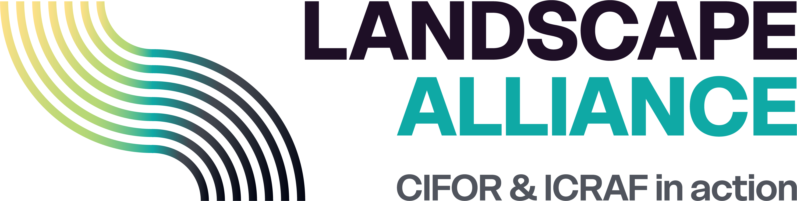
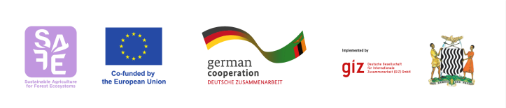

::: {.content-visible when-format="pdf"}
```{=latex}
\vfill
\begin{center}
  \includegraphics[height=2.2cm]{images/Landscape-Alliance-logo.png}
  \hspace{2cm}
  \includegraphics[height=2.2cm]{images/SAFE_logos.png}
\end{center}
\clearpage
```
:::

## Foreword

*[Foreword text to be inserted]*

---

## Acknowledgements

::: {.index-logos}


:::

::: {.acknowledgements-text}
This activity is a partnership between Landscape Alliance and the SAFE (Sustainable Agriculture for Forest Ecosystems) project, financed by the European Union (EU), the Ministry of Foreign Affairs of Netherlands and the German Federal Ministry for Economic Cooperation and Development (BMZ). SAFE is part of the Fund for the Promotion of Innovation in Agriculture (i4Ag) and implemented by Deutsche Gesellschaft für Internationale Zusammenarbeit (GIZ). The aim of this collaboration is to understand whether community forestry in Zambia is delivering the desired outcomes in terms of sustainable forest management and economic development.

The activity is also a collaboration between Landscape Alliance and the Government of the Republic of Zambia through the Ministry of Green Economy and Environment and the Department of Forestry.

The contents of this report are the sole responsibility of Landscape Alliance and do not necessarily reflect the views of the EU, the Federal Ministry for Economic Cooperation and Development (BMZ), the Ministry of Foreign Affairs of the Netherlands, or the Government of the Republic of Zambia.
:::

---

## Contents

| Chapter | Title |
|:--------|:------|
| [Summary](Summary.html) | Executive summary of findings and headline conclusions |
| [Recommendations](Recommendations.html) | Recommendations for government, NGOs and carbon enterprises |
| [Introduction](Introduction.html) | Background, policy context and objectives |
| [Survey Overview](CFMG Survey.html) | Survey design, sample characteristics and methods |
| [Governance](CFMG Governance.html) | CFMG legal, governance and business processes |
| [Sustainable Forest Management](CFMG SFM.html) | Community perceptions of forest condition and SFM outcomes |
| [Remote Sensing Analysis](Remote Sensing.html) | Satellite evidence on fire, deforestation and biomass change |
| [Economic Transformation](CFMG ET.html) | Employment, income, carbon finance and forest enterprises |
| [Equity and Inclusion](CFMG BS.html) | Benefit sharing, gender equity and poverty impacts |
| [Discussion](Conclusions.html) | Synthesis and cross-cutting findings |
| [Appendix I – Methods](Methods.html) | Detailed methodology |
| [Appendix II – Survey tool](Appendix.html) | Survey instrument |
| [Appendix III – List of CFs surveyed](Appendix II.html) | All community forests in the sample |
| [Appendix IV – CFMG performance index scores](Appendix III.html) | Governance, SFM, economic and equity index scores by CFMG |

---

## Abbreviations

| Abbreviation | Definition |
|:-------------|:-----------|
| BCP | BioCarbon Partners |
| CF | Community Forest |
| CFM | Community Forest Management |
| CFMG | Community Forest Management Group |
| Landscape Alliance | Landscape Alliance (formerly CIFOR-ICRAF) |
| CLMM | Cumulative Link Mixed Model |
| COMACO | Community Markets for Conservation |
| CRB | Community Resource Board |
| DFO | District Forestry Officer |
| FAO | Food and Agriculture Organization of the United Nations |
| FGD | Focus Group Discussion |
| FPIC | Free, Prior and Informed Consent |
| GIZ | Deutsche Gesellschaft für Internationale Zusammenarbeit |
| GLMM | Generalised Linear Mixed Model |
| GRZ | Government of the Republic of Zambia |
| HFO | Honorary Forest Officer |
| JFM | Joint Forest Management |
| NDC | Nationally Determined Contribution |
| NGO | Non-governmental Organisation |
| NTFP | Non-timber Forest Product |
| REDD+ | Reducing Emissions from Deforestation and forest Degradation |
| SFM | Sustainable Forest Management |
| SI | Statutory Instrument |
| ZIFLP | Zambia Integrated Forest Landscape Programme |
